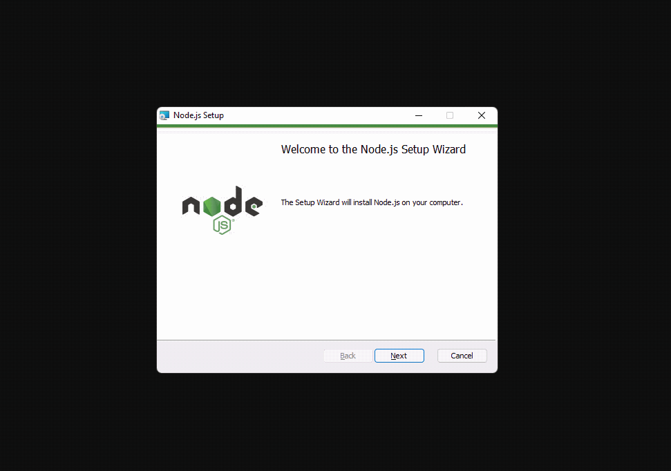

<h1 align="center"><b>Organizador de Escala JW</b></h1>

Ajuda você a organizar a reunião de meio de Semana e fazer as designações

    <a href="#tecnologias">Tecnologias</a> •
    <a href="#instalação">Instalação</a> •
    <a href="#autor">Autor</a> •
    <a href="#contato">Contato</a>

---

### <b>Tecnologias</b>

- [x] <b style="font-size: 12px">NEXT.js</b>
- [x] <b style="font-size: 12px">TypeScript</b>
- [x] <b style="font-size: 12px">SCSS</b>

---
### <b>Instalação</b>

Infelizmente não é possível colocar esse programa e disponibilizá-lo na internet sem um custo mensal, se eu fizesse isso precisaria cobrar uma mensalidade ou assinatura para usar o programa. Por isso, aqui está o passo a passo necessário para instalar esse programa no seu computador (que precisa ser <b>Windows 8.1</b> para cima (ou seja, vai funcionar no <kbd>Windows 8.1, 10, 11</kbd>), Windows 8 ou 7 para baixo <b>não</b> vai funcionar), dito isso, todo o processo é bem simples e só precisa de 2 Passos.

<b>Passo 1 - Instalar o Node</b>
  
O Node é um programa necessário para usar o nosso programa, sem ele nada funciona, baixe ele no link abaixo, depois é só dar dois cliques e ir avançando, veja como é rápido no vídeo abaixo

  <ol>
    <li>Clique no link ao lado para baixar o Node - <a href="https://nodejs.org/dist/v18.12.1/node-v18.12.1-x64.msi">(Clique aqui para baixar)</a></li>
    <li>Clique com o botão direito no arquivo e execute como Administrador</li>
    <li>Faça como mostrado no vídeo abaixo, depois vá para o passo 2</li>
    
  </ol>

<b>Passo 2 - Baixar o `Organizador de Escala JW`</b>
  <ol>
    <li>Clique no link ao lado para baixar o Organizador de Escala JW - <a href="https://github.com/ThalyssonLeite/organizador-de-escala-jw/archive/refs/heads/main.zip">(Clique aqui para baixar)</a></li>
    <li>Extraia o arquivo <kbd>organizador-de-escala-jw-main.zip</kbd>.</li>
    <li>Depois de extrair você pode renomear a pasta <kbd>organizador-de-escala-jw-main</kbd> para <kbd>Organizador de Escala JW</kbd>.</li>
    <li>Você pode renomear a pasta mas nunca o conteúdo dentro dela e NUNCA exclua essa pasta, caso contrário vai ter que baixar de novo.</li>
  </ol>

<b>Passo 3 - Tudo Pronto!</b>
  <ol>
    <li>Deu tudo certo! Para usar o programa basta entrar na pasta que você extraiu (no passo 2) e clicar em <kbd>Iniciar Programa</kbd>.</li>
    <li>Daí seu navegador de internet padrão vai abrir (como o Goolgle Chrome ou Edge) <b>não feche ele</b>, basta aguardar o Organizador de Escala JW iniciar.</li>
  </ol>

---
### <b>Autor</b>

 Feito com 🧡 e Respeito por Thalysson 🥛<a href="https://www.google.com/search?q=milk+in+portuguese&oq=milk+in+portuguese&aqs=chrome..69i57.4303j0j1&sourceid=chrome&ie=UTF-8">(click here if you are not brazilian)</a>

---
### <b>Contato</b>

Contato para sugestões e problemas técnicos: <b>thalyssonl17@gmail.com</b>

